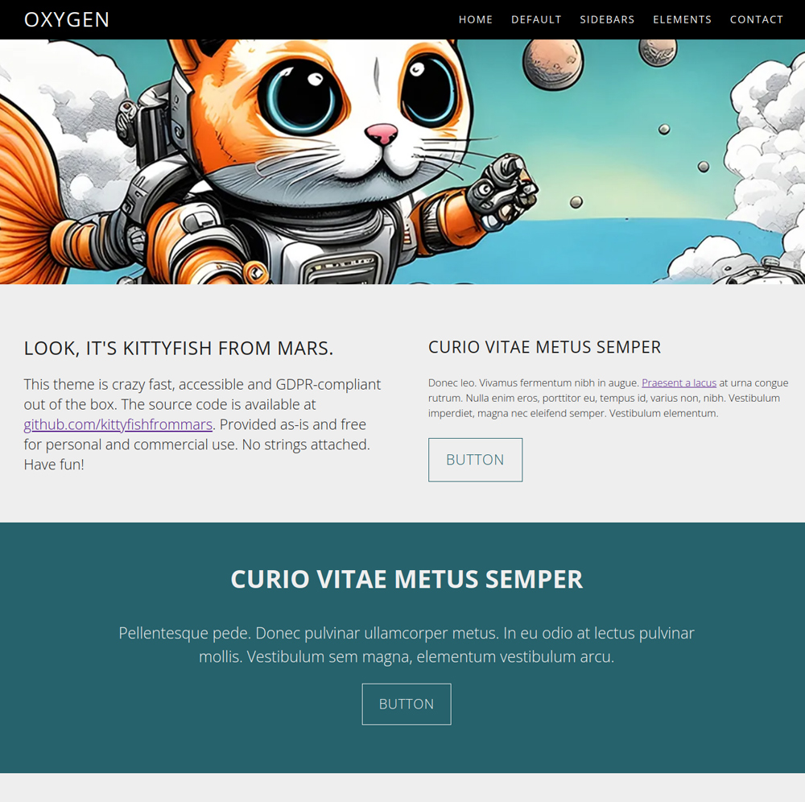

# Oxygen Theme

Oxygen by [kittyfishfrommars](https://github.com/kittyfishfrommars) is a continuation of [hughbris](https://github.com/hughbris/grav-theme-solarize) work for [Grav CMS](http://github.com/getgrav/grav).

---
Demo: [kittyfishfrommars.github.io](https://kittyfishfrommars.github.io/grav/grav-theme-oxygen)

## Summary

> Please see [CHANGELOG.md](CHANGELOG.md) for a detailed list of features included in this release.

* Oxygen is screen-reader friendly and meets **Accessibility** standards
* Asset delivery has been optimized for **Performance**
* Grav's admin plugin is supported via blueprints for ease of **Maintenance**
* Preconfigured to set no cookies, no third-party connections for **GDPR-compliance**

This theme includes a legally required [Contact page](_demo/pages/099.contact/default.md), with mandatory data pre-filled, to help with [GDPR](https://en.wikipedia.org/wiki/General_Data_Protection_Regulation) and [Press Regulations](https://secureprivacy.ai/blog/what-is-an-impressum). Please make sure to update your personal data and privacy statement to your specific use case. National laws apply.

There's an additional [Elements page](_demo/pages/098.elements/default.md) included to allow you to identify gaps in the theme's styling. There are a few.

## Installation

### GPM Installation (Preferred)

The simplest way to install this theme is via the [Grav Package Manager (GPM)](http://learn.getgrav.org/advanced/grav-gpm) through your system's Terminal (also called the command line).  From the root of your Grav install type:

    bin/gpm install oxygen

This will install the theme into your `/user/themes` directory within Grav. Its files can be found under `user/themes/oxygen`.

> This method will copy the sample pages provided in the `_demo/pages` folder to your `user/pages` folder so that the theme will work out of the box with placeholder content.

### Manual Installation

> Please note that the demo content and configuration is not copied when your plugin or theme is installed via the Admin plugin. Please refer the provided files from the `_demo` folder.

To install this theme, download the zip version of this repository and unzip it under `user/themes`. Then, rename the folder to `oxygen`. You can find these files either on [GitHub](https://github.com/kittyfishfrommars) or via [GetGrav.org](http://getgrav.org/downloads/themes).

You should now have all the theme files under

    user/themes/oxygen

> It's easiest to adapt the default configuration and content provided with the original theme: move the contents of `_demo` into your grav installations's `user/pages` directory to ensure that the theme templates work out of the box.

### Setup

If you want to set Oxygen as the default theme, you can do so by following these steps:

* Navigate to `grav/user/config`.
* Open the **system.yaml** file.
* Change the `theme:` setting to `theme: oxygen` and save your changes.
* Open the **site.yaml** file.
* Add this line at the bottom: `taxonomies: [tag]` and save your changes.
* Clear the Grav cache. The simplest way to do this is by going to the root Grav directory in Terminal and typing `bin/grav clear-cache`.

Once this is done, you should be able to see the new theme on the frontend. Keep in mind any customizations made to the previous theme will not be reflected as all of the theme and templating information is now being pulled from the `oxygen` folder.

## Troubleshooting

### 500 Internal Server Error

If you're getting this error, it means your current installation does not yet have the proper [permissions](https://learn.getgrav.org/17/troubleshooting/permissions).

The nuclear option is, of course, **not recommended for production**:

    chmod 777 grav-skeleton-oxygen -R

Where `grav-skeleton-oxygen` is your installation folder.

## Updating

As development for the Oxygen theme continues, new versions may become available that add additional features and functionality, improve compatibility with newer Grav releases, and generally provide a better user experience. Updating Oxygen is easy, and can be done through Grav's GPM system, as well as manually.

### GPM Update (Preferred)

The simplest way to update this theme is via the [Grav Package Manager (GPM)](http://learn.getgrav.org/advanced/grav-gpm). You can do this with this by navigating to the root directory of your Grav install using your system's Terminal (also called command line) and typing the following:

    bin/gpm update oxygen

This command will check your Grav install to see if your theme is due for an update. If a newer release is found, you will be asked whether or not you wish to update. To continue, type `y` and hit enter. The theme will automatically update and clear Grav's cache.

### Manual Update

Manually updating this theme is pretty simple. Here is what you will need to do to get this done:

* Delete the `user/themes/oxygen` directory.
* Download the new version of the oxygen theme from either [GitHub](https://github.com/kittyfishfrommars) or [GetGrav.org](http://getgrav.org/downloads/themes#extras).
* Unzip the zip file in `user/themes` and rename the resulting folder to `oxygen`.
* Clear the Grav cache. The simplest way to do this is by going to the root Grav directory in terminal and typing `bin/grav clear-cache`.

> Note: Please backup any changes you have made to any of the files. Files listed under this directory will also be removed and replaced by the new set. Any files located elsewhere (for example a YAML settings file placed in `user/config/themes`) will remain intact.

## Supported Templates

* [Sample home template](templates/home.html.twig)
* [Default content template](templates/default.html.twig)
* [Sidebar template](templates/sidebar.html.twig)
* [Link Module](templates/modular/links.html.twig)
* [Footer template](templates/partials/footer.html.twig)
* [Error template](templates/error.html.twig)
* [Sitemap template](templates/sitemap.html.twig)

## Examples in the wild

* [kittyfishfrommars.github.io](https://kittyfishfrommars.github.io/grav/grav-theme-oxygen/) - Theme "Oxygen" developed by [kittyfishfrommars](https://github.com/kittyfishfrommars)
* [juedisch.info](https://juedisch.info) - Jewish activism (german)
* [behold.metamotive.co.nz](https://behold.metamotive.co.nz/solarize) - Original Grav port "Solarize" by [hughbris](https://github.com/hughbris/)

## Credits
* Theme "Oxygen" developed by [kittyfishfrommars](https://github.com/Kittyfishfrommars) under the [MIT License](https://opensource.org/license/mit/), for modifications see [Changelog](https://github.com/Kittyfishfrommars/grav-skeleton-oxygen/blob/main/CHANGELOG.md)
* Based on the Grav port by [hughbris](https://github.com/hughbris/grav-theme-solarize/) under the [MIT License](https://github.com/hughbris/grav-theme-solarize/blob/develop/LICENSE)
* Developed for [Grav CMS](https://getgrav.org/) under the [MIT License](https://github.com/getgrav/grav/blob/master/LICENSE.txt)
* Header image created by [DeepAI](https://deepai.org/machine-learning-model/text2img) under its [Generated Content License](https://deepai.org/terms-of-service/terms-of-service)
* Design inspired by "Solarize" of [templated.co](https://templated.co) under the [Creative Commons 3.0 Attribution License](https://creativecommons.org/licenses/by/3.0/)
* Font Awesome 4.0.3 by @davegandy - [fontawesome.io](http://fontawesome.io) @fontawesome License - [fontawesome.io/license](https://fontawesome.io/license) (Font: SIL OFL 1.1, CSS: MIT License)
* OpenSans[wdth,wght].woff2: Copyright 2020 The Open Sans Project Authors [github.com/googlefonts/opensans](https://github.com/googlefonts/opensans) (SIL OFL 1.1)
