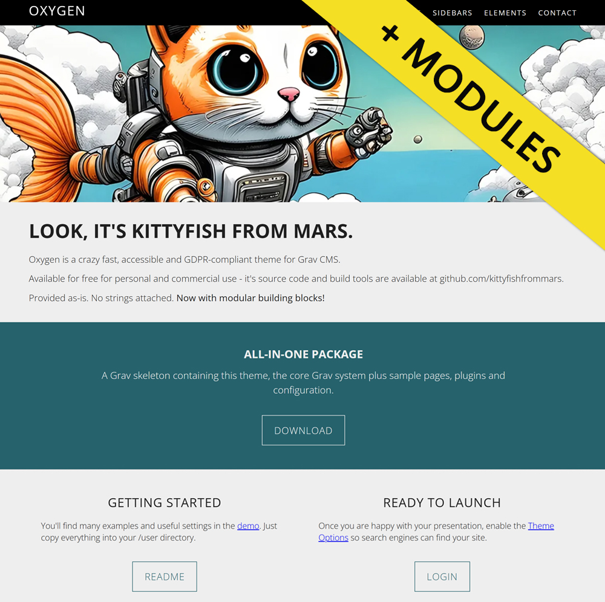

# Oxygen Theme

Oxygen by [kittyfishfrommars](https://github.com/kittyfishfrommars) is a continuation of [hughbris](https://github.com/hughbris/grav-theme-solarize) work for [Grav CMS](http://github.com/getgrav/grav).

---
Demo: [kittyfishfrommars.github.io](https://kittyfishfrommars.github.io/grav/grav-theme-oxygen)

All-in-one package: [grav-skeleton-oxygen](https://github.com/kittyfishfrommars/grav-skeleton-oxygen/releases/)

## README

Please refer to [grav-oxygen-theme](https://github.com/kittyfishfrommars/grav-theme-oxygen/blob/main/README.md) for comprehensive setup instructions.
